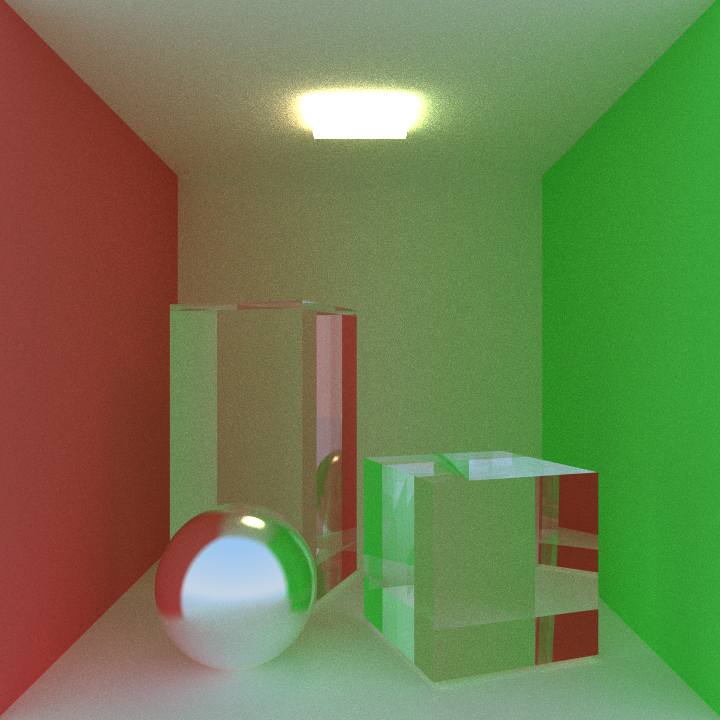
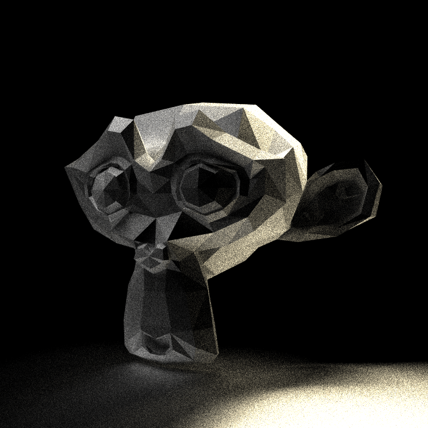
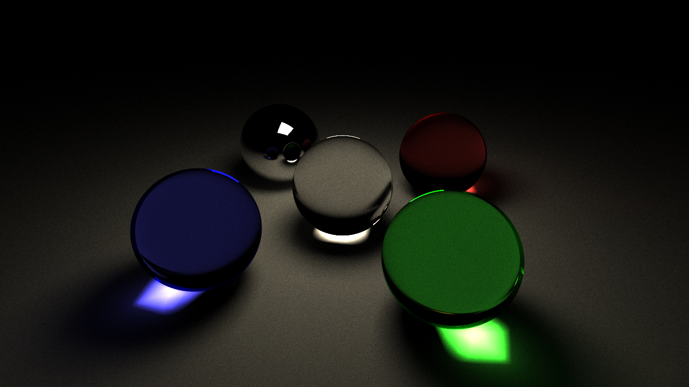
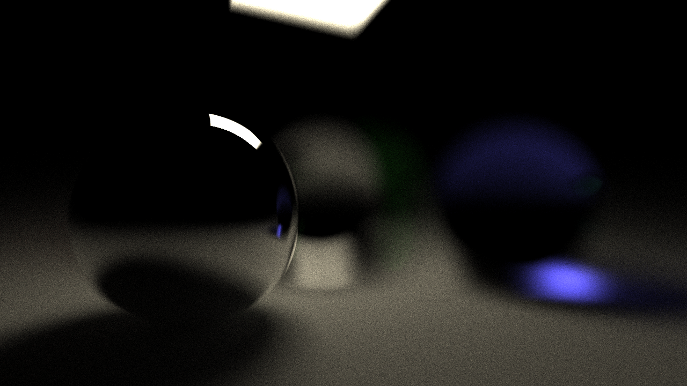
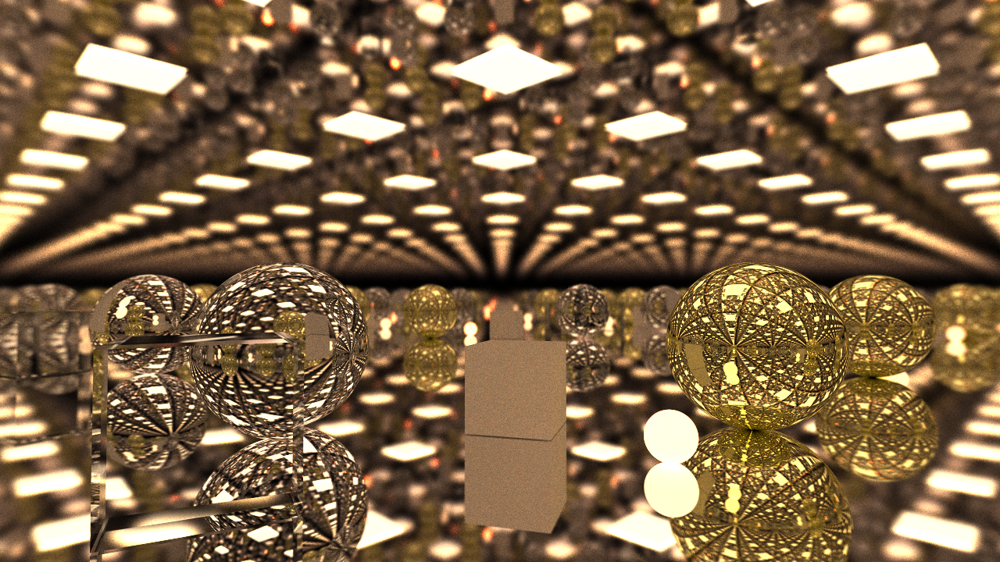

<div align="center">
    <strong>minitracer</strong>
    <p>A single-header, multi-threaded software raytracer.</p>
</div>

This is a zero-library raytracer, examples use raylib to display a window.

## Features
- A multi-threaded progressive or still renderer
- A STL model importer
- A sky system
- A BMP exporter
- Reflective, refractive, and emissive materials
- Simulated depth of field

## Screenshots

<table>
    <tr>
        <td>
            
            <br>
            <a href="./examples/cornell_box.c">cornell_box.c</p>
        </td>
        <td>
            
            <br>
            <a href="./examples/suzanne.c">suzanne.c</p>
        </td>
    </tr>
</table>
<table>
    <tr>
        <td>
            
            <br>
            <a href="./examples/balls.c">balls.c (Camera 1)</p>
        </td>
        <td>
            
            <br>
            <a href="./examples/balls.c">balls.c (Camera 2)</p>
        </td>
        <td>
            
            <br>
            <a href="./examples/balls.c">balls.c (Camera 3)</p>
        </td>
    </tr>
</table>
<table>
    <tr>
        <td>
            
            <br>
            <a href="./examples/balls.c">infinite.c</p>
        </td>
    </tr>
</table>

---

## Usage
```c
#include "minitracer.h"

int main(void)
{
    int width = 320;
    int height = 180;

    MT_World *world = mt_world_create(1000);
    MT_Environment *environment = mt_environment_create();
    environment->brightness = 1;
    mt_world_set_environment(world, environment);

    MT_Camera *camera = mt_camera_create();
    camera->position.z = 4;
    camera->position.y = -0.5f;

    MT_Renderer *renderer = mt_renderer_create(width, height, 16);
    mt_renderer_set_world(renderer, world);
    mt_renderer_set_camera(renderer, camera);
    mt_renderer_set_samples(renderer, 64);
    mt_renderer_set_bounces(renderer, 4);
    mt_renderer_set_progressive(renderer, 0);
    mt_renderer_set_antialiasing(renderer, 1);

    MT_Material *mat_diffuse = mt_material_create();
    mat_diffuse->color = (MT_Vec3){1, 0, 0};
    MT_Material *mat_glossy = mt_material_create();
    mat_glossy->roughness = 0.1f;

    MT_Mesh *floor = mt_mesh_create_plane((MT_Vec3){0, 0, 0}, (MT_Vec3){0, 0, 0}, (MT_Vec3){50, 1, 50}, mat_glossy);
    mt_world_add_object(world, floor, MT_OBJECT_MESH);
    MT_Mesh *cube = mt_mesh_create_cube((MT_Vec3){0, -0.5f, 0}, (MT_Vec3){0, MT_PI / 4.0f, 0}, (MT_Vec3){1, 1, 1}, mat_diffuse);
    mt_world_add_object(world, cube, MT_OBJECT_MESH);

    mt_render(renderer);

    MT_Vec3 *pixels = (MT_Vec3 *)malloc(sizeof(MT_Vec3) * width * height);
    mt_renderer_get_pixels(renderer, pixels, 1.0f, 1);
    mt_bmp_write("render.bmp", pixels, width, height);

    return 0;
}

```

## Resources Used
[**Ray Tracing in One Weekend**](https://raytracing.github.io) \
[**Sebastian Lague's Ray Tracing Coding Adventure**](https://www.youtube.com/watch?v=Qz0KTGYJtUk)
