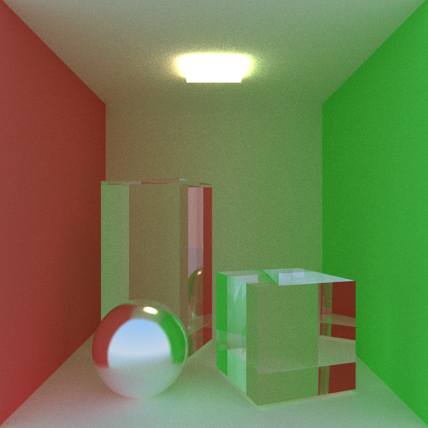
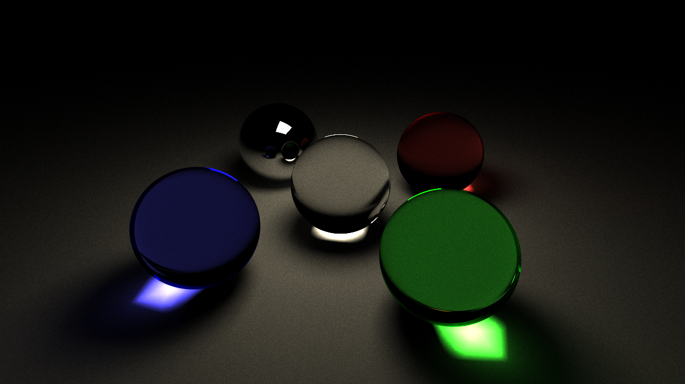
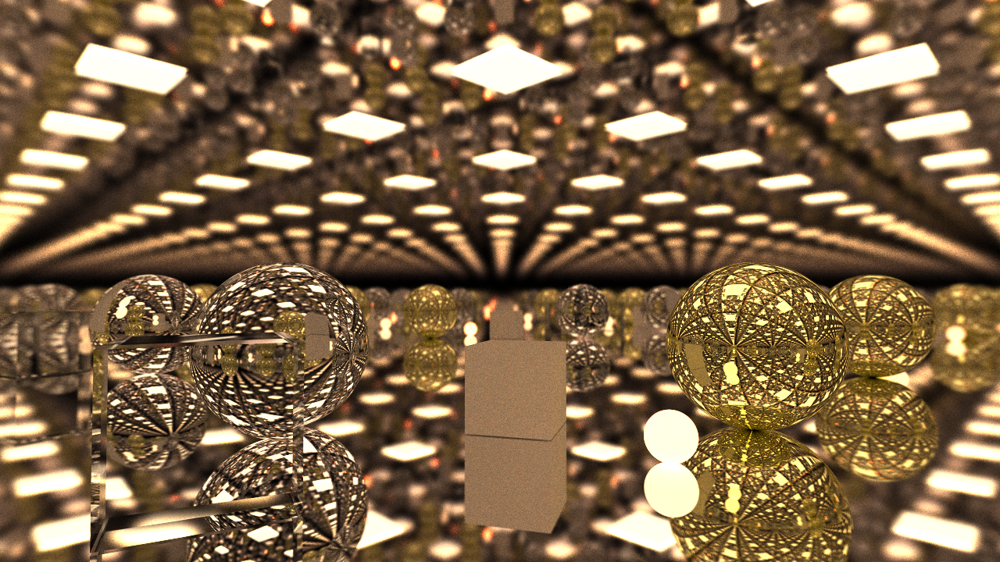

<div align="center">
    <strong>minitracer</strong>
    <p>A single-header, multi-threaded software raytracer.</p>
</div>

This is a zero-library raytracer, examples use raylib to display a window.

## Features
- A multi-threaded progressive or still renderer
- A STL model importer
- Reflective, refractive, and emissive materials
- A sky system
- A BMP exporter

## Screenshots

<table>
    <tr>
        <td>
            
            <br>
            <a href="./examples/cornell_box.c">cornell_box.c</p>
        </td>
        <td>
            
            <br>
            <a href="./examples/cornell_box.c">cornell_box.c</p>
        </td>
    </tr>
</table>
<table>
    <tr>
        <td>
            
            <br>
            <a href="./examples/balls.c">balls.c</p>
        </td>
        <td>
            
            <br>
            <a href="./examples/balls.c">infinite.c</p>
        </td>
    </tr>
</table>

---

## Usage
```c
#include "minitracer.h"

int main(void)
{
    MT_World *world = mt_world_create(1000); // setup world, 1000: max objects
    MT_Camera *camera = mt_camera_create();  // setup camera
    MT_Environment *environment = mt_environment_create(); // setup environment
    environment->brightness = 1.0f;
    mt_world_set_environment(world, environment);
}


```

## Resources Used
[**Ray Tracing in One Weekend**](https://raytracing.github.io) \
[**Sebastian Lague's Ray Tracing Coding Adventure**](https://www.youtube.com/watch?v=Qz0KTGYJtUk)
